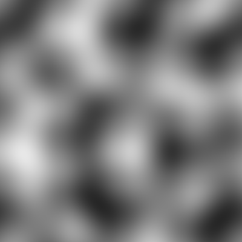
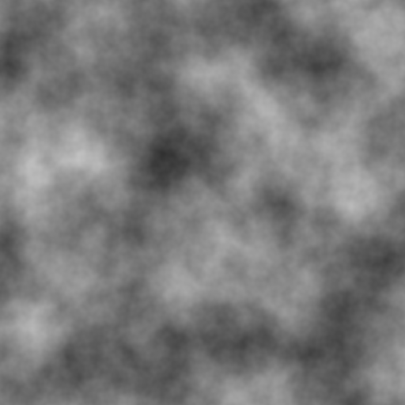
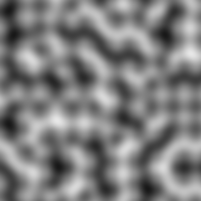
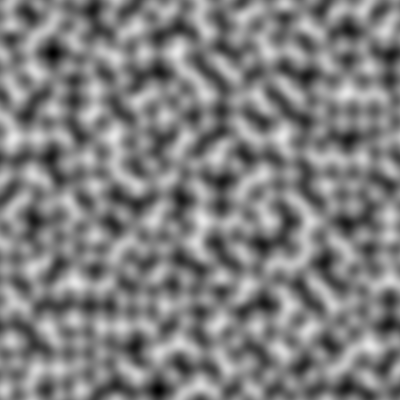

Ever wanted to simply generate tileable noise textures in rust ? You are at the right place ! This crate allows you to generate perlin noise texture and many more with ease.

# Output samples
These are some examples of the output you can get using txture :

  

# Installing
Simply add the lib to your Cargo.toml to start playing :
```toml
[dependencies]
txture = "*"
```
***or*** with cargo-edit :
```console
me@computer:~$ cargo add txture
```

To learn more about this library, go check on [crates.io](https://crates.io/crates/txture) or on [github](https://github.com/ferdinandklr/txture) !

# How to use
***Please note that some use cases of this lib can be seen in the [test](https://github.com/ferdinandklr/txture/tree/master/tests) folder !***

## A simple perlin noise texture
Start by importing the crate where you need it :

```rust
use txture::PerlinNoise;
```
Then create a new `PerlinNoise` instance, precising :
1) The size of the picture as `u32`
2) The number of gradient points you want as `u8` _(check pictures for a better understanding of what gradients are)_
3) whether the picture should be tilable or not as `bool`

The output is of type `Result<PerlinNoise, txture::Error>`, so you have to unwrap it. You cant try for example :
```rust
let perlin_noise = PerlinNoise::new(400, 5, true).unwrap();
```

Then,  to access any pixel in the picture, all you have to do is write :
```rust
let gray: u8 = perlin_noise.get_pixel_value(i, j);
```

the following output were obtained with a number of gradient points of 2, 5, 10 and 20 :

   

# Author
- **Ferdinand Keller** - feel free to explore my github repos

# License
This project is under the MIT license ([LICENSE-MIT](https://github.com/ferdinandklr/txture/tree/master/LICENSE-MIT) or [opensource website](https://opensource.org/licenses/MIT))
